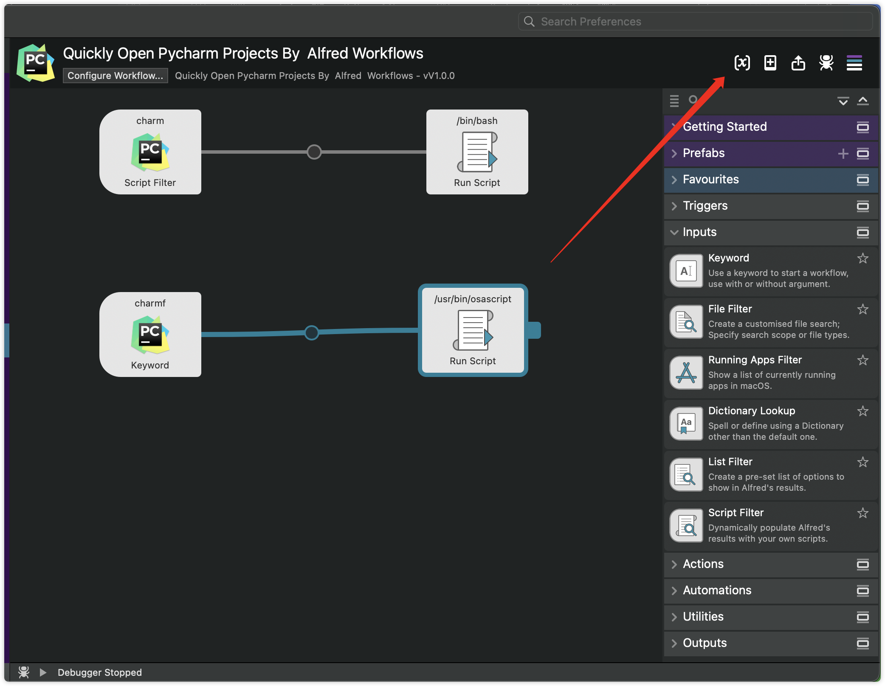
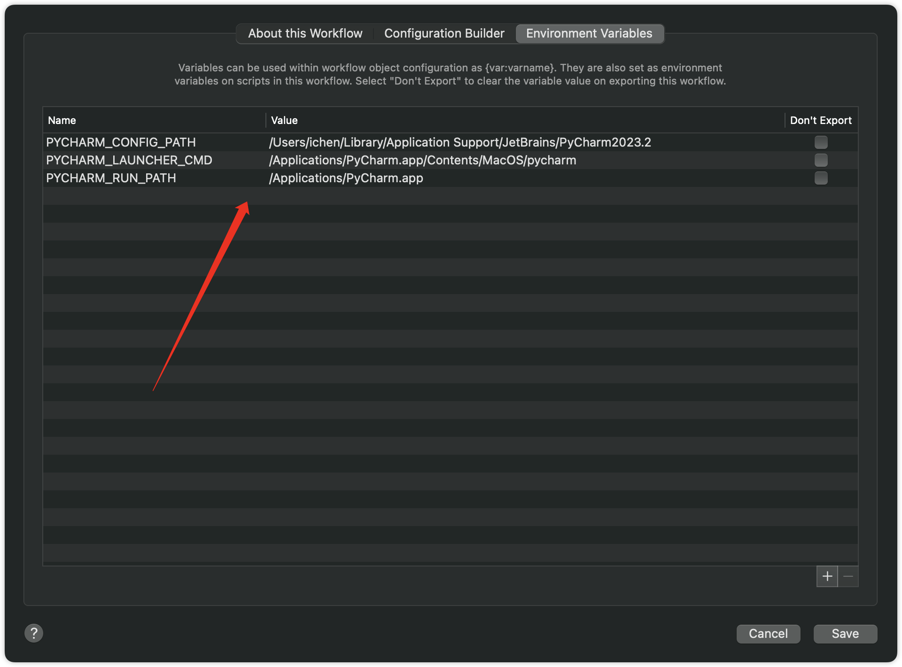
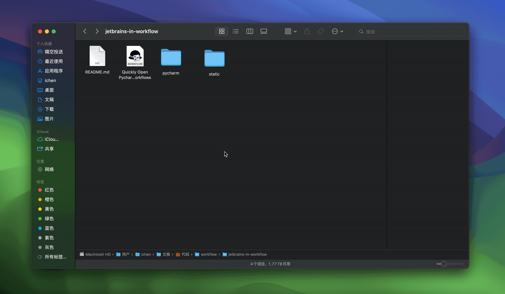
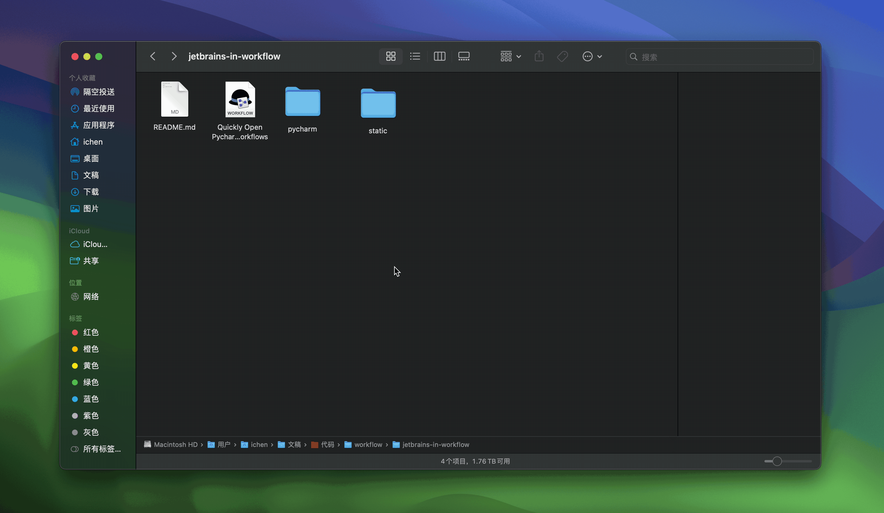
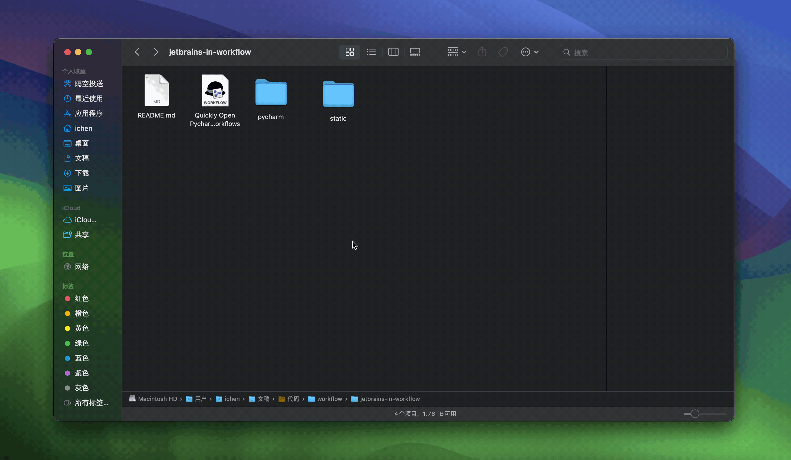
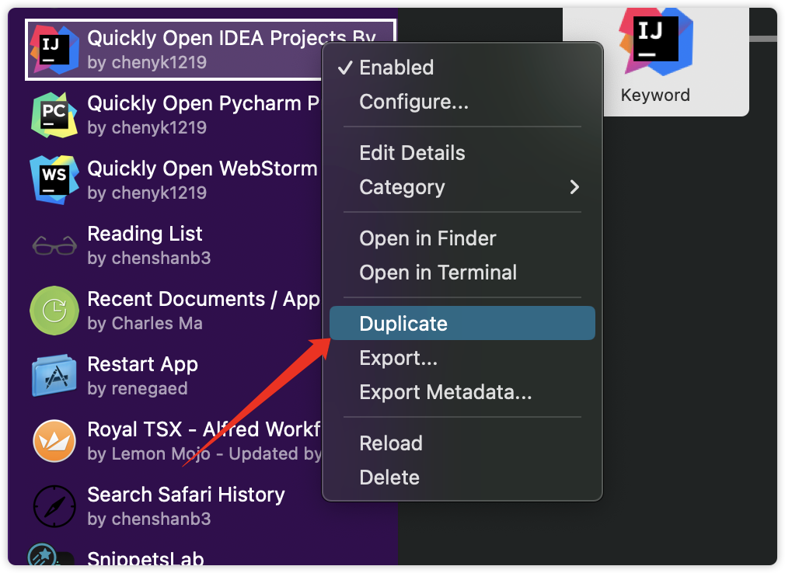

### 使用Alfred快速打开JetBrains的项目 + 类似于windows右键快捷打开

> 本项目是基于[Alfred](https://www.alfredapp.com/)和[JetBrains](https://www.jetbrains.com/)开发的快速打开项目的workflow，目前只支持MacOS系统。

> 通过验证的版本：Alfred 5.x，IDE 2023.x
---

### 1. 安装（所有的IDE均通用，这里以Pycharm为例）

#### 1.1 安装WorkFlow

从 [release](https://github.com/chenyk1219/jetbrains-in-workflow/releases)下载最新的workflow文件，双击安装即可。

#### 1.2 配置WorkFlow环境变量

**必须要改，因为家目录用简写方式`~`不生效，要写绝对路径`/User/xxxx`，可以使用以下命令得到家目录路径**

```shell
echo $HOME
```
or
```shell
echo ~
```





变量说明

|       name        |   description    |                              value                              |
|:-----------------:|:----------------:|:---------------------------------------------------------------:|
|PYCHARM_CONFIG_PATH|    pycharm的配置文件存放路径     |/Users/ichen/Library/Application Support/JetBrains/PyCharm2023.2 |
|PYCHARM_LAUNCHER_CMD| pycharm二进制文件执行路径 |/Applications/PyCharm.app/Contents/MacOS/pycharm|
|PYCHARM_RUN_PATH|   pycharm安装路径    |/Applications/PyCharm.app/Contents/MacOS/pycharm|

#### 1.3 安装recode解决xml文件中文显示乱码问题

```shell
brew install recode
```

### 2. 使用

#### 2.1 打开历史项目

在Alfred中输入`charm`，选中项目名称，回车即可打开。



#### 2.2 打开文件夹（类似于windows里的右键快捷打开）

如果在当前Finder中没有选中具体文件夹，则会打开当前窗口所在的文件夹



如果在当前Finder中选中了具体文件夹，则会打开选中的文件夹



#### 2.3 打开文件

和打开文件夹操作一样，如果你选中的是文件而不是文件夹，那么就会打开文件

### 3. 说明

#### 3.1 原理

利用IDE自带的命令行工具加上特定参数和路径，可以打开IDE并打开指定的项目或文件夹。

#### 3.2 为什么要用IDE自带的命令行工具

因为懒，每次打开项目需要先打开IDE，然后再打开项目，太麻烦了，所以就想着能不能直接打开项目，然后就找到了IDE自带的命令行工具，然后就有了这个workflow。

#### 3.3 static文件夹里放了常用的IDE的图标可以直接拿去用

### 4. 其他项目怎么使用

直接在Alfred的workflow中复制一份，然后修改环境变量即可，其他的不用改（还需要换个图标，图标在static文件夹里）。

