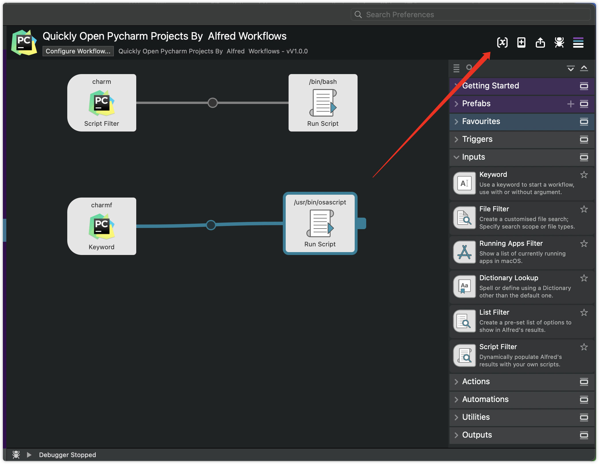
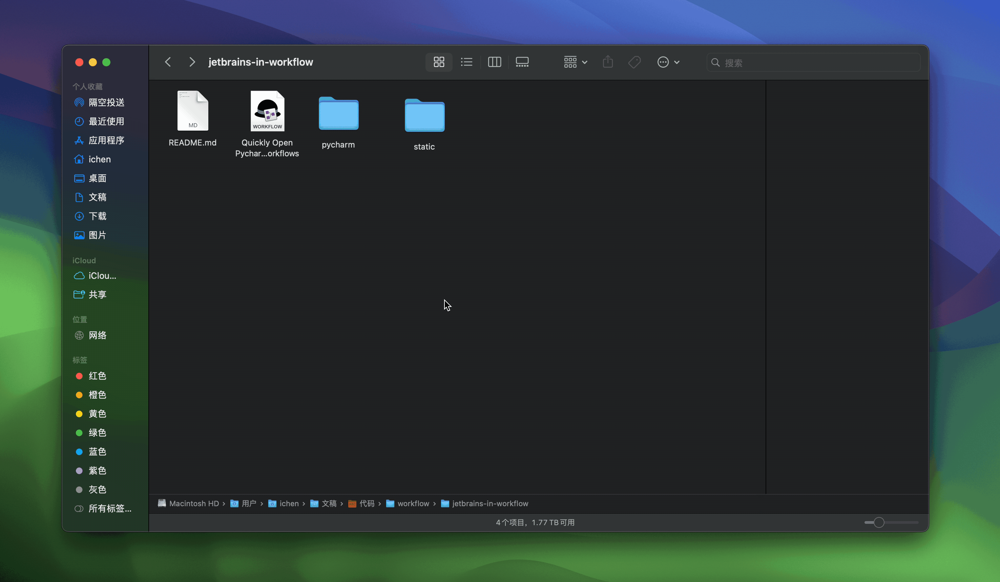
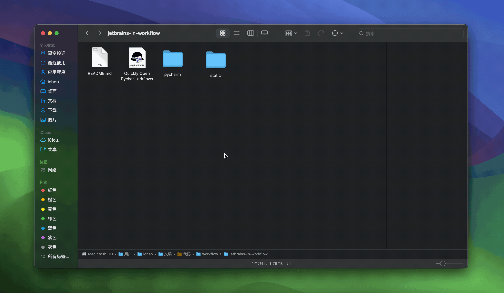

### Use Alfred to quickly open JetBrains projects + similar to Windows right-click shortcut opening

---

> This project is based on the workflow for quickly opening projects developed by Alfred and JetBrains. It currently only supports MacOS systems.

> Verified versions: Alfred 5.x, IDE 2023.x


### 1. Installation (common to all IDEs, here we take Pycharm as an example)

#### 1.1 Download the workflow file

Download the latest workflow file from release and double-click to install it.

#### 1.2 Configure WorkFlow environment variables

It must be changed because the abbreviation ~ for the home directory does not work. You need to write the absolute path /User/xxxx . You can use the following command to get the home directory path.

```shell
echo $HOME
```
or
```shell
echo ~
```




Variable description

|       name        |   description    |                              value                              |
|:-----------------:|:----------------:|:---------------------------------------------------------------:|
|PYCHARM_CONFIG_PATH|    Pycharm configuration file storage path     |/Users/ichen/Library/Application Support/JetBrains/PyCharm2023.2 |
|PYCHARM_LAUNCHER_CMD| pycharm binary file execution path |/Applications/PyCharm.app/Contents/MacOS/pycharm|
|PYCHARM_RUN_PATH|   pycharm installation path    |/Applications/PyCharm.app/Contents/MacOS/pycharm|

#### 1.3 Install `recode` to solve the garbled display of Chinese in xml files

```shell
brew install recode
```

### 2. Use

#### 2.1 Open the history project

Enter charm in Alfred, select the project name, and press Enter to open it.



#### 2.2 Open the folder (similar to the right-click shortcut to open in Windows)

If no specific folder is selected in the current Finder, the folder where the current window is located will be opened


If a specific folder is selected in the current Finder, the selected folder will be opened.



#### 2.3 Open file

Just like opening a folder, if you select a file instead of a folder, the file will be opened.

### How to use other projects

Just copy it directly in Alfred's workflow, and then modify the environment variables. No other changes are needed (you also need to change the icon, which is in the static folder).

